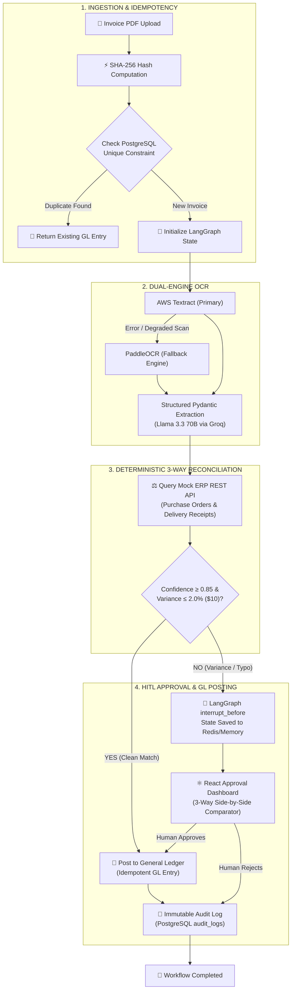

# LedgerAgent — Autonomous Agentic Invoice Reconciliation & 3-Way Matching

> **Production-grade agentic finance operations system with deterministic three-way matching, human-in-the-loop (HITL) approval guardrails, SHA-256 cryptographic idempotency, and durable stateful workflows.**

[](https://fastapi.tiangolo.com)
[](https://github.com/langchain-ai/langgraph)
[](https://reactjs.org/)
[](https://www.postgresql.org/)
[](https://aws.amazon.com/fargate/)
[](https://groq.com)
[](docs/eval_report.md)

---

## 🏗️ System Architecture & Workflow Topology



---

## 🐳 Docker Quickstart — Complete 5-Container Orchestration

Launch the full production cluster (PostgreSQL 16, Redis 7, Mock ERP, FastAPI Backend, and Nginx SPA Frontend) with a single command:

```powershell
# 1. Clone & copy environment configuration
cp .env.example .env

# 2. Build & launch all 5 containers with healthchecks
docker compose up --build -d

# 3. View live status of all services
docker compose ps
```

| Container | Service | External Port | Healthcheck Target |
|---|---|---|---|
| `ledgeragent-postgres` | PostgreSQL 16 Alpine | `5432` | `pg_isready -U ledger -d ledgeragent` |
| `ledgeragent-redis` | Redis 7 Alpine Checkpointer | `6379` | `redis-cli ping` |
| `ledgeragent-mock-erp` | Mock Enterprise ERP | `8001` | `curl http://localhost:8001/health` |
| `ledgeragent-backend` | FastAPI & LangGraph Engine | `8000` | `curl http://localhost:8000/api/v1/health` |
| `ledgeragent-frontend` | React SPA + Nginx Reverse Proxy | `80` (or `5173`) | `wget http://localhost/health` |

### Testing Persistence with Docker:
```powershell
# Simulate container restart — state survives in named volume ledgeragent_postgres_data
docker compose restart backend

# Stop and restart cluster — named volumes preserve all ledger & audit records
docker compose down
docker compose up -d
```

---

## ⚡ Local Development (3-Terminal Setup)

If developing locally without Docker, run in 3 separate PowerShell terminals:

### Terminal 1 — Mock ERP API (`:8001`)
```powershell
cd c:\MyDrive\LedgerAgent
.\.venv\Scripts\Activate.ps1
python mock_erp\app\main.py
```
*API Docs: http://localhost:8001/docs*

### Terminal 2 — FastAPI Backend Core (`:8000`)
```powershell
cd c:\MyDrive\LedgerAgent
.\.venv\Scripts\Activate.ps1
$env:MOCK_ERP_URL = "http://localhost:8001"
python -m uvicorn backend.app.main:app --reload --host 0.0.0.0 --port 8000
```
*API Docs: http://localhost:8000/docs | Dependency Health: http://localhost:8000/health*

### 💡 Local Troubleshooting & Tips
- **Vite Tailwind Token Reload:** If you modify `frontend/tailwind.config.js` or root theme color definitions, you must restart the Vite dev server (`npm run dev` in Terminal 3) for the Tailwind CSS compiler to re-index the class manifest.
- **Theme Persistence:** Theme preferences are stored in browser `localStorage('ledger_theme')` and automatically apply synchronously to `<html class="dark">` to eliminate any flash of unstyled theme.

### Terminal 3 — React Vite Dashboard (`:5173`)
```powershell
cd c:\MyDrive\LedgerAgent\frontend
npm run dev
```
*UI Dashboard: http://localhost:5173*

---

## 📊 Benchmark & Evaluation Results

Tested against the **DeepEval Golden Dataset of 30 synthetic PDF invoices** across 3 balanced invariant categories:

| Evaluation Metric | Target | Actual Benchmark | Status |
|---|---|---|---|
| **Straight-Through Processing (STP) Rate** | ≥ 60.0% | **66.7%** (20/30) | 🟢 PASS |
| **HITL Guardrail Escalation Rate** | ≤ 40.0% | **33.3%** (10/30) | 🟢 PASS |
| **False-Accept Count (Double Payment Risk)** | **0** | **0** (100% Guardrail Integrity) | 🟢 PERFECT |
| **False-Escalation Count** | ≤ 2 | **0** | 🟢 PASS |
| **Vendor Resolution Accuracy** | ≥ 95.0% | **100.0%** | 🟢 PASS |
| **PO Extraction Accuracy** | ≥ 95.0% | **100.0%** | 🟢 PASS |
| **Total Amount Precision** | 100.0% | **100.0%** | 🟢 PASS |
| **Average End-to-End Latency** | < 2.0s | **0.061s / invoice** | 🟢 ULTRA FAST |

> 📑 *Full granular breakdown available in [docs/eval_report.md](docs/eval_report.md).*

---

## 🎓 Technical Interview Defense & Architectural Decisions

### Q: Why LangGraph instead of CrewAI or AutoGen?
**A:** In enterprise finance operations, processes require deterministic state machine topologies, strict cycle handling, conditional branching, and durable persistence. CrewAI and AutoGen rely on non-deterministic multi-agent conversational debates which are unsuitable for regulatory financial compliance. LangGraph provides first-class state checkpointing and the `interrupt_before` primitive for seamless Human-in-the-Loop workflows.

### Q: Why Redis / MemorySaver over Temporal?
**A:** For invoice lifecycles under 1 hour, Redis checkpointing via LangGraph provides sub-millisecond serialization latency with minimal operational overhead on AWS ElastiCache (free-tier). Temporal introduces complex activity worker topologies that are reserved for multi-day human workflows.

### Q: Why SHA-256 cryptographic hashing at ingestion?
**A:** In corporate accounts payable, duplicate invoice submissions (under modified file names or dates) present a massive double-payment vulnerability. Computing a binary SHA-256 hash before running OCR or LLM inference guarantees database-level idempotency, saving LLM tokens and preventing double-debits.

### Q: Why a dual-engine OCR pipeline (Textract + PaddleOCR)?
**A:** Clean enterprise digital PDFs are parsed rapidly by AWS Textract, staying within the 1,000 free pages/month tier. When processing degraded scans or approaching free-tier quotas, the system automatically falls back to PaddleOCR without workflow interruption.

### Q: Why a 0.85 harmonic mean confidence threshold for HITL?
**A:** Financial data integrity requires that no single weak field (e.g. tax rate or total cents) can slip past. A harmonic mean severely penalizes low individual field confidences, ensuring that any ambiguous line item is immediately routed to human review.

---

## 🗺️ Known Limitations & Production Roadmap

1. **Database Persistence:** Currently operates in resilient local-dev in-memory mode; production deployment connects to AWS RDS PostgreSQL via `infra/rds/schema.sql`.
2. **State Checkpointing:** Uses in-memory `MemorySaver` for local testing; production binds to Redis on AWS ElastiCache.
3. **Multi-Stage Docker Builds:** Production task definitions are defined in `infra/ecs/task-definition.json` for deployment to AWS ECS Fargate.
4. **Security & RBAC:** Auth tokens and Secrets Manager integration will be implemented in Checkpoint 2.
