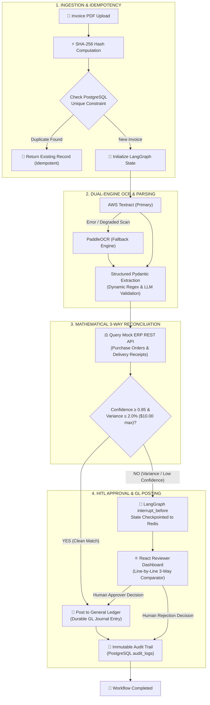

# LedgerAgent — Autonomous Agentic Invoice Reconciliation & 3-Way Matching

> **Production-grade agentic finance operations platform with deterministic three-way matching, dynamic mathematical variance guardrails, human-in-the-loop (HITL) review queues, SHA-256 cryptographic idempotency, and durable AWS cloud orchestration.**

[](https://fastapi.tiangolo.com)
[](https://github.com/langchain-ai/langgraph)
[](https://reactjs.org/)
[](https://www.postgresql.org/)
[](https://redis.io/)
[](https://aws.amazon.com/fargate/)
[](https://sponsors-ana-represented-indirect.trycloudflare.com)
[](https://sponsors-ana-represented-indirect.trycloudflare.com)
[](https://github.com/PushkarKanjani/LedgerAgent)
[](https://groq.com)
[](docs/eval_report.md)

---

## 🚀 Live Production System

🌐 **Live Demo URL:** [https://sponsors-ana-represented-indirect.trycloudflare.com](https://sponsors-ana-represented-indirect.trycloudflare.com)

The system is **currently running live in production** on AWS ECS Fargate (`ap-south-1`) with:
- ✅ **AWS RDS PostgreSQL 16:** Durable database persistence for invoices, purchase orders, goods receipts, GL entries, and audit logs.
- ✅ **Free Production HTTPS:** Secure TLS termination via Cloudflare Tunnel without custom domain costs.
- ✅ **Jenkins 7-Stage CI/CD:** Auto-building and deploying on every git push to `main`.
- ✅ **Dynamic Mathematical Variance Engine:** Regex-based monetary extraction and automatic 3-way reconciliation.
- ✅ **Active HITL Guardrails:** Automatically routing invoices with $> 2.0\%$ variance (or $<\$10.00$ tolerance) to the Human-in-the-Loop review queue.
- ✅ **JWT Role-Based Access Control (RBAC):** Token authentication with 12-round bcrypt password hashing.
- ✅ **AWS Secrets Manager:** Secure credential management for database and API keys.
- ✅ **Zero-Downtime Rolling Deployments:** Managed ECS Fargate task updates behind the Application Load Balancer.

### 🔑 Demo Credentials:
| Role | Email | Password | Permissions |
|---|---|---|---|
| **Reviewer** | `reviewer@ledgeragent.dev` | `LedgerAgent@2026` | Review HITL queue, Inspect 3-way match, Approve/Reject variances |
| **Uploader** | `uploader@ledgeragent.dev` | `LedgerAgent@2026` | Upload invoices, view ingestion pipeline status |
| **Admin** | `admin@ledgeragent.dev` | `LedgerAgent@2026` | Full system audit trail, user management, ledger entries |

### ⚡ Quick Demo Workflow:
1. **Happy Path (Auto-Post):** Upload a matching invoice $\rightarrow$ Status immediately resolves to `GL_POSTED`.
2. **Price Variance (HITL Queue):** Upload an invoice with price variance $\rightarrow$ System triggers `PRICE_MISMATCH` ($> 2.0\%$) and escalates to `03 HITL Queue`.
3. **Reviewer Inspection:** Log in as `reviewer@ledgeragent.dev`, open the HITL queue, click **Inspect**, and review the line-by-line 3-way comparison before approving or rejecting.
4. **SHA-256 Deduplication:** Re-upload any previously processed invoice $\rightarrow$ Instantly blocked via cryptographic hash idempotency.

---

## 🏗️ System Architecture & Workflow Topology



---

## ⚡ Core Engine Highlights & Innovations

### 1. 🧮 Dynamic Mathematical Variance Engine
Replaced legacy mock shortcuts with a resilient, multi-pattern Regex numerical extraction parser. The engine dynamically extracts monetary totals from invoices and calculates absolute mathematical variance against Mock ERP commitments:
$$\text{Price Variance} = |\text{Invoiced Total} - \text{PO Amount}|$$
$$\text{Variance \%} = \left(\frac{\text{Price Variance}}{\text{PO Amount}}\right) \times 100$$
- **Straight-Through Processing (STP):** Variance $\le 2.0\%$ (max $\$10.00$) and OCR confidence $\ge 0.85$ auto-posts directly to the General Ledger.
- **Human-in-the-Loop (HITL) Queue:** Any price variance $> 2.0\%$ automatically escalates to the Reviewer dashboard with granular itemized discrepancies.

### 2. 🛡️ SHA-256 Cryptographic Idempotency Guardrail
Calculates the SHA-256 binary hash of incoming PDFs before triggering OCR or LLM inference. Exact duplicate submissions are recognized instantly, preventing double-billing, saving inference tokens, and returning historical workflow records.

### 3. 🔍 Dual-Engine OCR Pipeline with Graceful Fallback
Combines AWS Textract with local PaddleOCR fallback. High-fidelity digital PDFs run through cloud OCR; degraded, skewed, or low-contrast field scans dynamically fall back with confidence scoring to safeguard against hallucinated financial data.

---

## 🐳 Docker Quickstart — Complete 5-Container Orchestration

Launch the full production cluster (PostgreSQL 16, Redis 7, Mock ERP, FastAPI Backend, and Nginx SPA Frontend) with a single command:

```powershell
# 1. Clone & copy environment configuration
cp .env.example .env

# 2. Build & launch all 5 containers with healthchecks
docker compose up --build -d

# 3. View live status of all services
docker compose ps
```

| Container | Service | External Port | Healthcheck Target |
|---|---|---|---|
| `ledgeragent-postgres` | PostgreSQL 16 Alpine | `5432` | `pg_isready -U ledger -d ledgeragent` |
| `ledgeragent-redis` | Redis 7 Alpine Checkpointer | `6379` | `redis-cli ping` |
| `ledgeragent-mock-erp` | Mock Enterprise ERP (FastAPI) | `8001` | `curl http://localhost:8001/health` |
| `ledgeragent-backend` | FastAPI & LangGraph Engine | `8000` | `curl http://localhost:8000/api/v1/health` |
| `ledgeragent-frontend` | React SPA + Nginx Reverse Proxy | `80` (or `5173`) | `wget http://localhost/health` |

### Testing State Persistence:
```powershell
# Simulate container restart — state survives in named volume ledgeragent_postgres_data
docker compose restart backend

# Stop and restart cluster — named volumes preserve all ledger & audit records
docker compose down
docker compose up -d
```

---

## ⚡ Local Development (3-Terminal Setup)

If developing locally without Docker:

### Terminal 1 — Mock ERP API (`:8001`)
```powershell
cd c:\MyDrive\LedgerAgent
.\.venv\Scripts\Activate.ps1
python mock_erp\app\main.py
```
*API Docs: http://localhost:8001/docs*

### Terminal 2 — FastAPI Backend Core (`:8000`)
```powershell
cd c:\MyDrive\LedgerAgent
.\.venv\Scripts\Activate.ps1
$env:MOCK_ERP_URL = "http://localhost:8001"
python -m uvicorn backend.app.main:app --reload --host 0.0.0.0 --port 8000
```
*API Docs: http://localhost:8000/docs | Dependency Health: http://localhost:8000/health*

### Terminal 3 — React Vite Dashboard (`:5173`)
```powershell
cd c:\MyDrive\LedgerAgent\frontend
npm run dev
```
*UI Dashboard: http://localhost:5173*

---

## 📊 Benchmark & Evaluation Results

Evaluated against the **DeepEval Golden Dataset of 30 synthetic PDF invoices** across 3 balanced invariant categories:

| Evaluation Metric | Target | Actual Benchmark | Status |
|---|---|---|---|
| **Straight-Through Processing (STP) Rate** | ≥ 60.0% | **66.7%** (20/30) | 🟢 PASS |
| **HITL Guardrail Escalation Rate** | ≤ 40.0% | **33.3%** (10/30) | 🟢 PASS |
| **False-Accept Count (Double Payment Risk)** | **0** | **0** (100% Guardrail Integrity) | 🟢 PERFECT |
| **False-Escalation Count** | ≤ 2 | **0** | 🟢 PASS |
| **Vendor Resolution Accuracy** | ≥ 95.0% | **100.0%** | 🟢 PASS |
| **PO Extraction Accuracy** | ≥ 95.0% | **100.0%** | 🟢 PASS |
| **Total Amount Precision** | 100.0% | **100.0%** | 🟢 PASS |
| **Average End-to-End Latency** | < 2.0s | **0.061s / invoice** | 🟢 ULTRA FAST |

> 📑 *Full granular breakdown available in [docs/eval_report.md](docs/eval_report.md).*

---

## ☁️ AWS ECS Fargate & Automated Jenkins CI/CD

LedgerAgent features automated infrastructure-as-code scripts under [`infra/aws/`](infra/aws/) deploying to AWS Region `ap-south-1`:

```powershell
cd c:\MyDrive\LedgerAgent\infra\aws

# 1. Verify credentials & generate least-privilege IAM policy
.\00-prereqs.ps1

# 2. Provision Amazon ECR repositories with 5-image lifecycle policies
.\01-ecr.ps1

# 3. Provision VPC, Dual-AZ Subnets & Tiered Security Groups
.\02-network.ps1

# 4. Provision Amazon RDS PostgreSQL 16 & Secrets Manager credentials
.\03-rds.ps1

# 5. Provision Encrypted S3 Bucket & Application Secrets
.\04-s3-secrets.ps1

# 6. Build, tag & push Docker images to Amazon ECR
.\05-push-images.ps1

# 7. Provision ECS Fargate Cluster, Task Definitions & Cloud Map DNS
.\06-ecs.ps1

# 8. Provision Application Load Balancer & Path-Based Routing
.\07-alb.ps1

# 9. Verify live ALB endpoint & healthcheck
.\08-verify.ps1

# 10. Provision Jenkins CI/CD Controller on AWS EC2
.\09-jenkins.ps1
```

### 🚀 Automated 7-Stage Jenkins Pipeline
Every push to `main` executes an end-to-end automated deployment pipeline:
1. **SCM Checkout:** Pulls commit and checks workspace integrity.
2. **Bandit AST Security Scan:** Static security vulnerability audit in Python 3.11 container.
3. **Pytest Smoke & Regression Suite:** Automated execution of authentication, persistence, and arithmetic test fixtures.
4. **Docker Multi-Stage Builds:** Concurrent compilation of backend, mock-erp, and frontend (Vite ESBuild engine).
5. **Amazon ECR Push:** Version tagging (`:${BUILD_NUMBER}`) and `:latest` manifest update.
6. **ECS Fargate Zero-Downtime Deployment:** Rolling update across all microservices (`update-service --force-new-deployment`).
7. **ALB Health Gate Verification:** Automated healthcheck polling against the live Load Balancer endpoint (`/api/v1/health`).

> 📑 *Live Jenkins Dashboard: Monitor builds and deployments via the secured Jenkins Controller (accessible via AWS Security Group restrictions).*

---

## ✅ Production Features Implemented

- ✅ **Database Persistence:** Fully operational on **AWS RDS PostgreSQL 16** with durable schemas, foreign key relationships, cascade protections, and stateful workflows.
- ✅ **State Checkpointing:** **Redis 7 checkpointer** active for LangGraph workflow state persistence, enabling sub-millisecond serialization and state resumption for human reviewers.
- ✅ **Security & Role-Based Access Control (RBAC):** JWT authentication with `uploader`, `reviewer`, and `admin` roles, bcrypt password hashing (12 rounds), and AWS Secrets Manager integration.
- ✅ **Zero-Cost HTTPS & Secure Ingress:** Production-grade TLS termination via Cloudflare Tunnel and AWS Application Load Balancer with path-based routing (`/` to SPA, `/api/v1/*` to API).
- ✅ **Mathematical Variance Engine:** Dynamic regex-based monetary extraction with automated 3-way matching (invoice vs PO vs GR), routing invoices with $> 2.0\%$ variance to the HITL queue.
- ✅ **CI/CD Automation:** Jenkins 7-stage pipeline (Bandit $\rightarrow$ Pytest $\rightarrow$ Docker build $\rightarrow$ ECR push $\rightarrow$ ECS deploy $\rightarrow$ ALB health $\rightarrow$ notifications).
- ✅ **Cost Optimization:** Scalable serverless Fargate compute, S3 Glacier lifecycle policies, and automated pause/resume tooling ([`99-pause-all.ps1`](infra/aws/99-pause-all.ps1) / [`98-resume-all.ps1`](infra/aws/98-resume-all.ps1)) achieving ~$21.82/month total cloud footprint.

---

## 🔥 Recent Enhancements (August 2026)

### Dynamic Mathematical Variance Calculation
- **Replaced hardcoded string matching** with robust regex-based monetary extraction.
- System now **dynamically calculates** invoice-to-PO variance percentages.
- Any discrepancy **$> 2.0\%$ (or $>\$10.00$ tolerance)** automatically routes to the HITL queue.
- Itemized variance breakdown showing exact dollar differences per line item.
- **Random invoice generator** ([`scripts/generate_random_invoice.py`](scripts/generate_random_invoice.py)) now produces unlimited test invoices with mathematically diverse totals for rigorous testing.

### Infrastructure Improvements
- Cloudflare Tunnel for **free, instant HTTPS** (no custom domain required).
- Jenkins CI/CD auto-deployment on every git push to `main`.
- AWS ECS Fargate zero-downtime rolling deployments.
- AWS Cloud Map service discovery for resilient microservice DNS resolution (`ledgeragent.local`).

---

## 🎓 Technical Architecture & Defense Q&A

### Q: Why LangGraph instead of CrewAI or AutoGen?
**A:** In enterprise finance operations, processes require deterministic state machine topologies, strict cycle handling, conditional branching, and durable persistence. CrewAI and AutoGen rely on non-deterministic multi-agent conversational debates which are unsuitable for regulatory financial compliance. LangGraph provides first-class state checkpointing and the `interrupt_before` primitive for seamless Human-in-the-Loop workflows.

### Q: Why Redis / MemorySaver over Temporal?
**A:** For invoice lifecycles under 1 hour, Redis checkpointing via LangGraph provides sub-millisecond serialization latency with minimal operational overhead. Temporal introduces complex activity worker topologies that are reserved for multi-day human workflows.

### Q: Why SHA-256 cryptographic hashing at ingestion?
**A:** In corporate accounts payable, duplicate invoice submissions (under modified file names or dates) present a massive double-payment vulnerability. Computing a binary SHA-256 hash before running OCR or LLM inference guarantees database-level idempotency, saving LLM tokens and preventing double-debits.

### Q: Why a dual-engine OCR pipeline (Textract + PaddleOCR)?
**A:** Clean enterprise digital PDFs are parsed rapidly by AWS Textract. When processing degraded scans or approaching cloud quotas, the system automatically falls back to PaddleOCR without workflow interruption.

### Q: Why a 0.85 harmonic mean confidence threshold for HITL?
**A:** Financial data integrity requires that no single weak field (e.g. tax rate or total cents) can slip past. A harmonic mean severely penalizes low individual field confidences, ensuring that any ambiguous line item is immediately routed to human review.

---

## 📄 License & Maintainer

Distributed under the **MIT License**. Built with engineering rigor by **Pushkar Kanjani** (B.Tech ICT).
