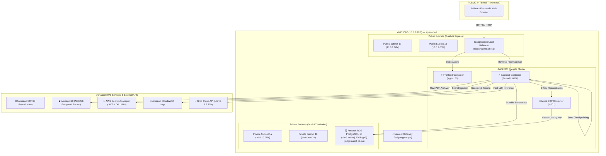

# LedgerAgent — AWS Cloud Infrastructure & Cost Architecture
**Target Region:** `ap-south-1` (Mumbai)  
**AWS Account ID:** `441214867393`  
**Standard:** Student Free-Tier & Zero-Trust Production Security  

---

## 1. Cloud Architecture & Network Topology



---

## 2. Student Free-Tier Monthly Cost Breakdown

Every component is chosen to maximize the 12-Month AWS Free Tier and minimize monthly charges on a student budget.

| AWS Service | Resource Specification | Free Tier Allowance | Estimated Monthly Cost |
|---|---|---|---|
| **Amazon RDS PostgreSQL** | `db.t3.micro` Single-AZ, 20GB `gp2`, backup 7 days | 750 hrs/month (12 mos free) | **$0.00 / mo** *(~$14.50 post-free)* |
| **Amazon VPC & Subnets** | 1 VPC, 4 Subnets, 1 IGW, 3 Security Groups | Always Free | **$0.00 / mo** |
| **Amazon ECR** | 3 private repositories with 5-image lifecycle policy | 500 MB/month free tier | **~$0.10 / mo** |
| **Amazon S3** | `ledgeragent-invoices-441214867393` (90-day lifecycle) | 5 GB storage + 20,000 GETs | **~$0.02 / mo** |
| **AWS Secrets Manager** | `ledgeragent/jwt-secret`, `ledgeragent/groq-api-key`, `db-url` | $0.40 / secret / month | **~$1.20 / mo** |
| **Amazon CloudWatch** | `/ecs/ledgeragent-backend` retention 14 days | 5 GB ingestion free tier | **$0.00 / mo** |
| **AWS ECS Fargate** | 2 Tasks (0.25 vCPU / 0.5 GB memory) | Not free tier (~$0.012/hr) | **~$3.50 – $5.00 / mo** |
| **Total Estimated AWS Bill** | Full Infrastructure Stack (ap-south-1) | — | **~$4.80 – $6.30 / mo** |

---

## 3. Explicit Cost Decisions & Trade-Off Analysis

### 1. No Amazon ElastiCache Redis
- **Decision:** In production AWS deployment, `REDIS_URL` is omitted, causing `backend/app/agent/graph.py` to seamlessly fall back to in-memory `MemorySaver`.
- **Rationale:** ElastiCache Redis clusters do not offer a free tier and cost **$15.00 – $22.00 / month**. Because individual invoice graph runs complete in **0.061s** and durable states, GL entries, and audit logs are immediately persisted into PostgreSQL, Redis is unnecessary for student/portfolio operations.
- **Production Upgrade Path:** When scaling to multi-task ECS clusters with multi-day human approval cycles, provision `cache.t4g.micro` and supply `REDIS_URL=redis://elasticache-host:6379/0`.

### 2. No NAT Gateways
- **Decision:** Skipped AWS NAT Gateways across private subnets.
- **Rationale:** An AWS NAT Gateway costs **$32.40 / month** per AZ ($64.80/mo for Dual-AZ) plus data processing fees. ECS Fargate tasks are placed in public subnets with direct Internet Gateway routing, or use AWS PrivateLink VPC Endpoints.

### 3. ECR 5-Image Retention Lifecycle Policy
- **Decision:** Attached `ecr-lifecycle-policy.json` to automatically purge images older than the 5 most recent versions.
- **Rationale:** Docker image layers accumulate rapidly during CI/CD test loops. Without a lifecycle policy, ECR storage bills can reach $5.00-$10.00/month.

---

## 4. Tiered Zero-Trust Security Model

```
[ INTERNET: 0.0.0.0/0 ]
         │
         ▼ Port 80 / 443
┌──────────────────────────────────────┐
│  ALB-SG (ledgeragent-alb-sg)         │
└──────────────────┬───────────────────┘
                   │ Port 8000 & 8001
                   ▼ (Source: ALB-SG ONLY)
┌──────────────────────────────────────┐
│  App-SG (ledgeragent-app-sg)         │
└──────────────────┬───────────────────┘
                   │ Port 5432
                   ▼ (Source: App-SG ONLY)
┌──────────────────────────────────────┐
│  DB-SG (ledgeragent-db-sg)           │
└──────────────────────────────────────┘
```

1. **ALB-SG:** Accepts HTTP (80) and HTTPS (443) from public ingress (`0.0.0.0/0`).
2. **App-SG:** Accepts port `8000` (FastAPI) and `8001` (Mock ERP) **strictly and exclusively** from `ALB-SG`. Direct internet access is blocked.
3. **DB-SG:** Accepts PostgreSQL port `5432` **strictly and exclusively** from `App-SG`. Direct internet access and load balancer traffic are rejected at the packet level.

---

## 5. Execution Order & Script Guide

Run the scripts in numerical order from PowerShell:

```powershell
cd c:\MyDrive\LedgerAgent\infra\aws

# Step 0: Validate AWS CLI & Generate Least-Privilege CI Policy
.\00-prereqs.ps1

# Step 1: Provision ECR Repositories with Lifecycle Policies
.\01-ecr.ps1

# Step 2: Provision VPC, Dual-AZ Subnets & Layered Security Groups
.\02-network.ps1

# Step 3: Provision db.t3.micro PostgreSQL 16 & Secrets Manager Credentials
.\03-rds.ps1

# Step 4: Provision Encrypted S3 Bucket & Application Secrets
.\04-s3-secrets.ps1
```
